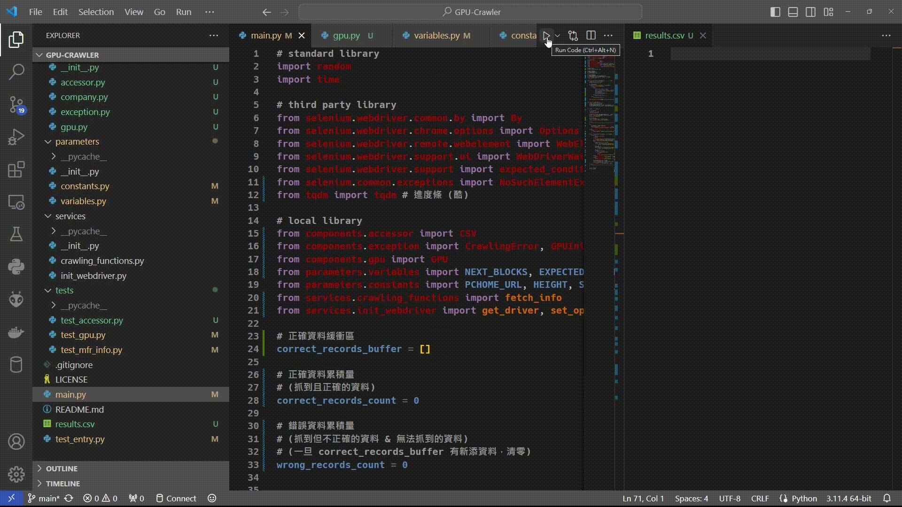

# GPU-Price-Crawler
<!-- Badges -->

[](https://www.python.org/downloads/release/python-3114/ "More details about Python 3.11.4")

[](./LICENSE)


## Brief
PChome 爬蟲，爬下顯卡的製造商、OEM、價格等等資訊，並整理於 CSV 檔。
+ `variables.py`：自訂想要爬的顯卡、要抓的總數量與爬蟲速度等等。
+ `main.py`：執行腳本入口。結果會直接產出在頂層目錄。
<!-- GIF -->



## Run Script

+ 建立虛擬環境
   ```bash
   pip install -r requirements.txt
   ```

+ 執行腳本
   ```bash
   run.bat
   ```


## To-do
+ [ ] pytest / unittest 單元測試 (純練習)
+ [ ] CPU 價格爬蟲
+ [ ] 跨網站爬蟲
+ [ ] 異步編程 (async)
+ [ ] 後端資料庫系統
+ [ ] 前端 UI


## Note

+ `2024/1/10` (v1.0.1)
  + 新增 NVIDIA 顯卡 RTX 4070 Super & RTX 4070 Ti Super & RTX 4080 Super
  + GPU 新增 link 屬性

+ `2024/1/20` (v1.1.0)
  + colorama (CLI 色彩文字)
  + 水平分隔線與終端機等寬
  + 例外的重構 (in *exception.py*)
